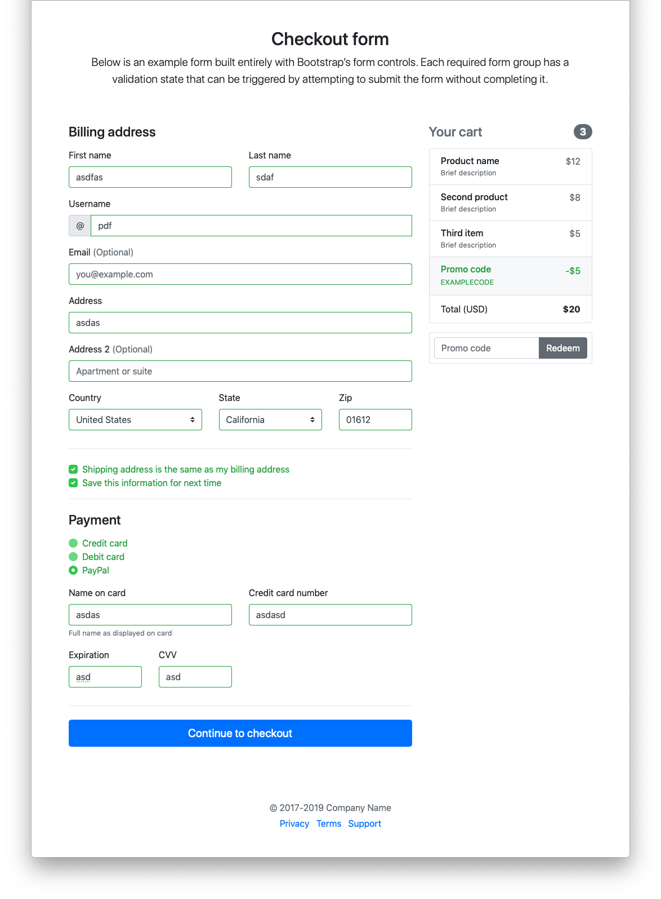

## ¿Por qué usar un framework para desarrollo web?

Imaginemos que tenemos que realizar una validación de una forma, esto
conllevaría tener que manejar el estado de cada uno de las entradas de texto
para mostrar un estilo de acuerdo al estado en el que se encuentra por lo que
podrás empezar a imaginar todos los accesos al DOM que tendríamos que hacer y
algunas estructura de datos para estructurar la información.

Esto para lo que hoy en día espera un usuario ver (UX / UI) resulta muy complejo
manejarlo con javascript puro, por lo que se recurre al uso de frameworks donde
nos ahorran escribir funciones e implementan metodologías que le dará un "boost"
a nuestra página web.

Así como la tendencia de la tecnología web para el desarrollo de aplicaciones
complejas, multiplataforma y con acceso al hardware.

### Actividades

##### 1.- Crear una forma con validación y estilo
De la carpeta de actividades tomar el proyecto ["why-framework"](./actividades/why-framework) y buscar que se vea igual que la imagen siguiente.

##### 2.- Crear una forma con validación y estilo (fácil)
De la carpeta de actividades tomar el proyecto "why-framework" y agregar
"bootstrap" como se indica en su página
[Pagina oficial ->](https://getbootstrap.com/docs/4.0/getting-started/introduction/)

[ver respuesta ->](./answers/why-framework)
