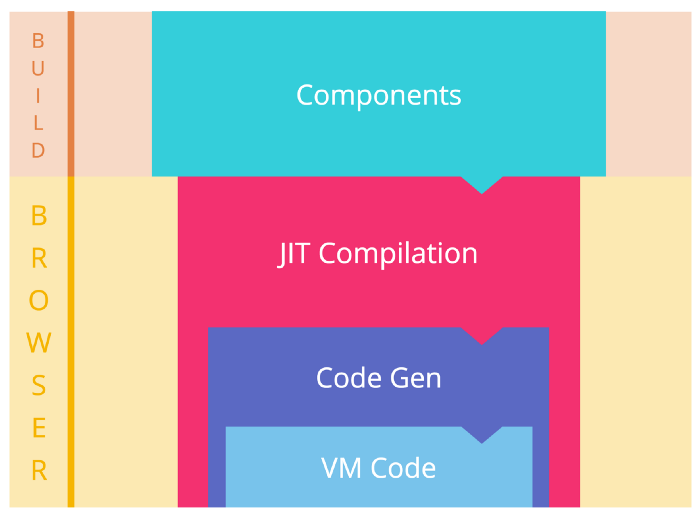
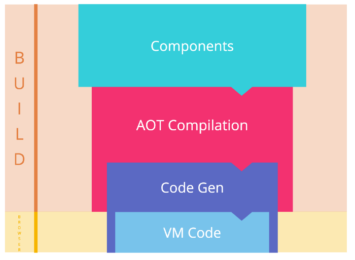

# CLI build

Una vez que logramos programar nuestra página web, tendremos que "compilar" nuestra aplicación para poderla servir en un servidor. Para esto se utilizan variables de configuración de ambiente las cuales pueden ser configuradas desde /src/environments/..., aquí tendremos dos archivos para poder tener variables de cofniguración que solo hagan referencia al momento de desarrollo y variables para el ambiente de producción.

Para compilar nuestra aplicación en modo producción utilizamos el siguiente comando:

```sh
$ ng build

$ ng build --help
Compiles an Angular app into an output directory named dist/ at the given output path. Must be executed from within a workspace directory.
usage: ng build <project> [options]

arguments:
  project
    The name of the project to build. Can be an application or a library.

options:
  --aot
    Build using Ahead of Time compilation.
  --base-href
    Base url for the application being built.
  --configuration (-c)
    A named build target, as specified in the "configurations" section of angular.json.
    Each named target is accompanied by a configuration of option defaults for that target.
    Setting this explicitly overrides the "--prod" flag
  --deploy-url
    URL where files will be deployed.
  --output-path
    The full path for the new output directory, relative to the current workspace.
    ...
    By default, writes output to a folder named dist/ in the current project.
  --prod
    Shorthand for "--configuration=production".
    When true, sets the build configuration to the production target.
    By default, the production target is set up in the workspace configuration such that all builds make use of bundling, limited tree-shaking, and also limited dead code elimination.
```

## AOT vs JIT

Las principales diferencias entre JIT y AOT en Angular son:

* El tiempo que tarda en compilar
* El lugar donde se va a compilar



Just In Time Compilation



Ahead Of Time Compilation

Flujo de eventos con compilación "Just-in-Time"

* Desarrollo de una aplicación Angular con Typescript
* Compilación de la aplicación con tsc
* Empaquetado
* Minificado
* Despliegue

Una ves que se desplego la aplicación y el usuario abre su explorador, la página irá por los siguientes pasos:

* Descargar todos los recursos de Javascript
* Inicializar Angular (bootstrap)
* Entra en el proceso de compilación JIT,  donde se genera el js de cada componente
* La aplicación se renderiza

Flujo de eventos con compilación "Ahead-Of-Time"

En contraste con lo anterior, con AoT, se deben seguir estos pasos:

* Desarrollar una aplicación de Angular con TypeScript.
* Compilar la aplicación con ngc.
* Hace la compilación de las plantillas con el compilador de Angular y genera (usualmente) TypeScript.
* Compilación del código de TypeScript a Javascript.
* Empaquetado.
* Minificado.
* Despliegue.

A pesar de que el proceso anterior parece ligeramente más complicado, el usuario solo debe concluir estos pasos:

* Descargar todos los recursos
* Inicializar Angular (bootstrap)
* La aplicación se renderiza.

Como se puede observar el tercer paso no está presente por lo que mejor el "UX"

[Referencia](https://medium.com/@jitubutwal144/basic-overview-of-just-in-time-jit-vs-ahead-of-time-aot-compilation-in-angular-applications-d24f04d8f7ca)

[<--](./README.md)
